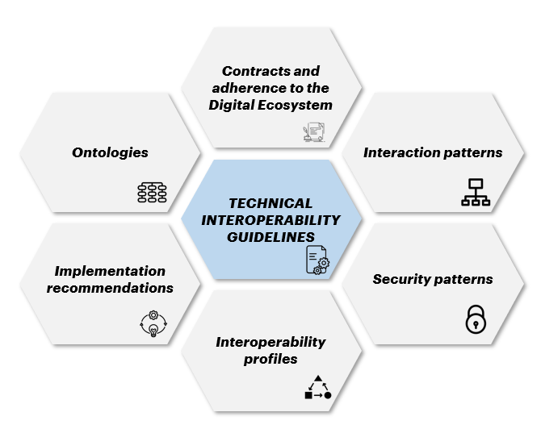

*2.1 Structure of document*
===========================

These Guidelines provide a general overview and are linked to Operative
Documents (DO) Figure 2 - Structure of the Guidelines and Operational
Documents - to which are linked for details on technological standards
and their methods of use to benefit from and / or provide digital data
and / or services through third party systems to and from the TDH:

+--------------------------+------------------------------------------------------------------------------------------------------------------------------------------------------+
| **Operative Document 1** | :download:`Interaction patterns <../media/TDH022_Operative_Document_Interaction_Patterns_ENG.pdf>`                                                   |
+--------------------------+------------------------------------------------------------------------------------------------------------------------------------------------------+
| **Operative Document 2** | :download:`Security patterns <../media/TDH022_Operative_Document_Security_Patterns_ENG.pdf>`                                                         |
+--------------------------+------------------------------------------------------------------------------------------------------------------------------------------------------+
| **Operative Document 3** | :download:`Interoperability profiles <../media/TDH022_Operative_Document_Platform_Interoperability_Profiles_ENG.pdf>`                                |
+--------------------------+------------------------------------------------------------------------------------------------------------------------------------------------------+
| **Operative Document 4** | :download:`Implementation recommendations <../media/TDH022_Operative_Document_Implementation_Recommendations_ENG.pdf>`                               |
+--------------------------+------------------------------------------------------------------------------------------------------------------------------------------------------+
| **Operative Document 5** | :download:`Ontologies <../media/TDH022_Operative_Document_Ontologies_ENG.pdf>`                                                                        |
+--------------------------+------------------------------------------------------------------------------------------------------------------------------------------------------+
| **Operative Document 6** | Contracts and adherence to the Digital Ecosystem                                                                                                     |
+--------------------------+------------------------------------------------------------------------------------------------------------------------------------------------------+

To ensure constant alignment with technological evolutions, the updating
of the DO is carried out by the operators in charge in compliance with
the timing and methods chosen for their updating.

|image0|

*Figure 2 – Guidelines and Operative Documents Structure*

