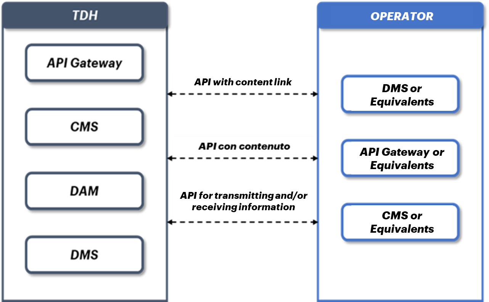

*4.2 Minimum requirements for TDH interconnection*
==================================================

In order to establish a connection between Operators and TDH, it is
recommended that parties wanting to interconnect with it equip
themselves with a technological infrastructure that allows them to
exchange/receive information and content, using an encrypted,
authenticated and authorized method.

In particular, for the Regions it is foreseen the sharing and/or
transmission of digital content (articles, images, videos etc...) and
information referring to POI (Points of Interest), Destinations,
Interests and Offers. Therefore, it is recommended that the Regions, if
they are not already so, equip themselves with specific tools capable of
managing the storage and, when necessary, the transmission of such
content (e.g., CMS).

In general, it is recommended that Operators interested in
interconnecting with the TDH have the appropriate application tools for
the bidirectional exchange of information with relative real time
updating where possible.

It is therefore possible to make the bidirectional TDH/Operator
connection via API by means of:

-  **API with content link:** in order to provide digital content shared
   by operators such as images, videos, articles, etc., APIs will be
   displayed with links to recall the resource (content) present in the
   Operator's CMS and presented by TDH;

-  **API with content:** in order to directly enjoy digital content
   shared by the above operators that is transmitted directly to the end
   user by the DMS;

-  **API for transmitting and/or receiving information:** for the
   purpose of information exchange between TDH and Regions/Operators.

|image0|

*Figure 5 – Explanatory diagram of the TDH/Region’s interconnection
through different APIs*

.. _section-2:

