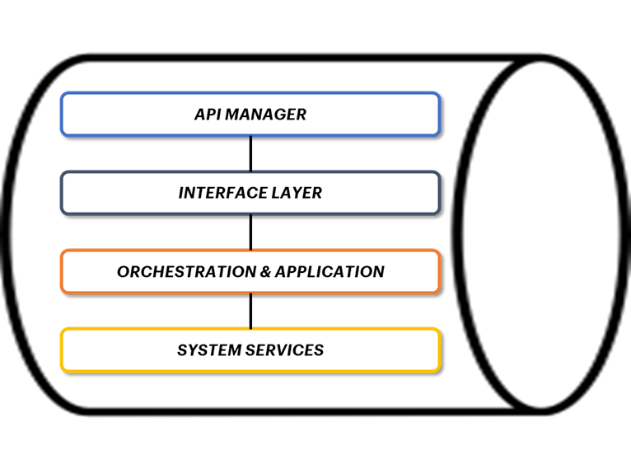

*4.1 Software System Platform*
==============================

For interoperability with Tourism Digital Hub, it is recommended that
Hosts (e.g., Authorities, Regions) use an application that allows to
manage APIs (invoke/expose) and enables to consult and monitor them,
guaranteeing their operational management:

-  **API Manager**: useful for setting access rules to your APIs and
   managing them;

-  **API Gateway**: a tool that manages APIs, interposing itself between
   a client and a series of back-end services; in essence, an API
   Gateway acts as a reverse proxy, accepting all API calls, and where
   authorizations and authentications are involved, it has the task of
   accepting only authorized/authenticated calls. It is also responsible
   for aggregating the various services requested, returning an
   appropriate result;

-  **Integration Platform**: tool that deals with the mediation between
   services in order to realize "loose-coupled" [1]_ (low dependency)
   models between providers and service users, thanks to the
   introduction of a broker middleware that deals with providing:

   -  protocol and data format conversions;

   -  policy in the interaction between providers and users (e.g.,
      auditing, logging and security monitoring);

   -  Logic for the invocation and forwarding of calls to services
      (dispatching).

It is also recommended to include the Orchestration component,
understood as the coordinated composition and execution of APIs that can
be organized into three macro-categories:

-  **Interface layer**: level of specific relevance of the Gateway,
   where the interfaces towards the clients that consume the service are
   realized;

-  **Application & Orchestration Services**: service level focused on
   the service logic domain, business process orchestration and
   abstracted from enterprise integration issues at the back-end level;

-  **System services**: services that operate at the integration level
   of individual back-end applications (e.g., Database, Host, Cloud
   SaaS).

In addition to this, it is necessary to provide "end to end" Monitoring
and Alerting functions of the API integration flows developed for the
purpose of TDH022 interoperability.

|image0|

*Figure 4 – Diagram explaining the API Gateway application platform*

.. [1]
    Reference: “Why is the Web Loosely Coopled? A Multi-Faceted Metric
   for Service Design” (Pautasso, Wilde – 2009) Online reference:
   http://www2009.eprints.org/92/1/p911.pdf

