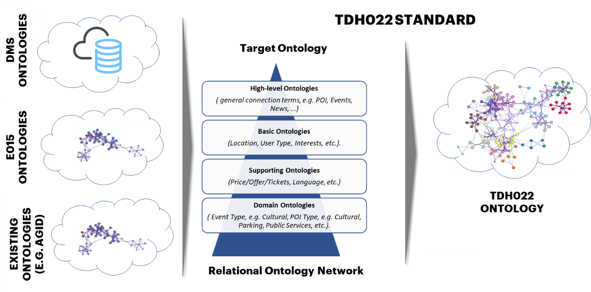
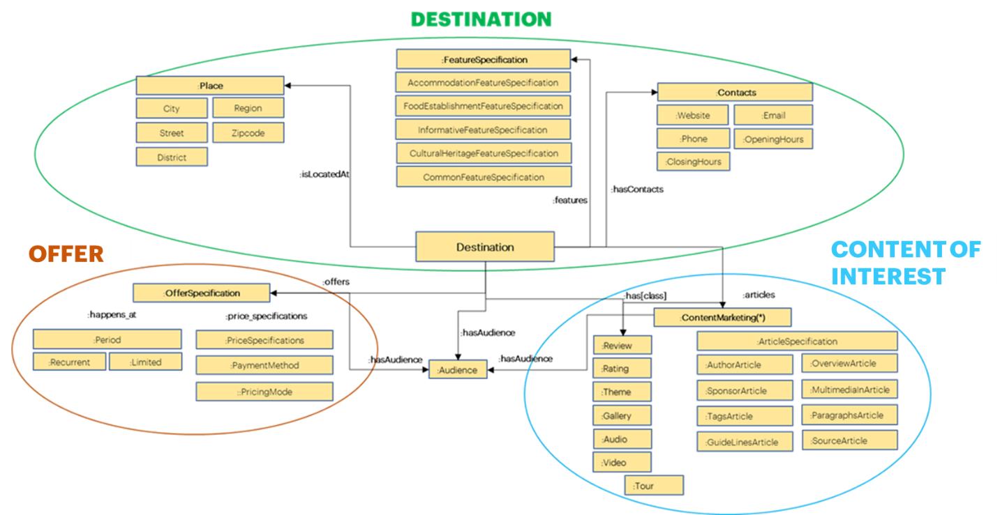
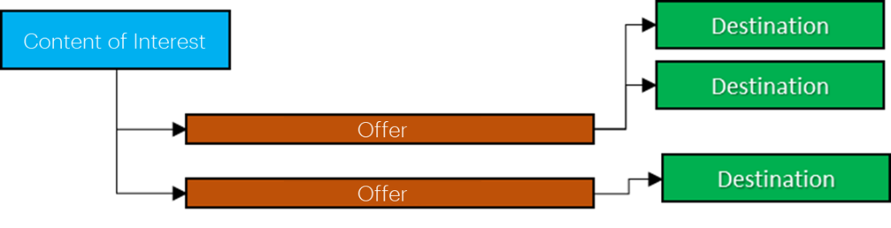

*6.3 Ontology development process*
==================================

*6.3.1 Ontology construction*
-----------------------------

Establishing a process for creating ontologies is so important to ensure
accuracy, cross-domain consistency, usability, and the opportunity to
incorporate them into a single ontology at a later stage.

The development of an ontology is primarily divided into five phases:

1. **Standards assessment:** establish organization-wide,
   machine-readable standards for description, concepts, and data
   context. This phase includes researching existing
   ontologies/knowledge graphs within and outside the organization,
   conducting strategic workshops with experts in the field. Next, the
   collection of available ontology best-practices, materials, and
   documents is conducted;

2. **Ontology definition:** in this step of the process, the semantics
   of the vocabularies of each domain, the classes, the relations and
   the properties of each domain are defined;

3. **Ontology development:** the ontologies themselves are built and
   merged, using the ontological features identified, and then proceed
   to build a higher-level ontological model connecting the selected
   domains. At this stage it is also necessary to create a catalog for
   mapping the ontology source data;

4. **Ontology instantiation:** once created, we proceed to configure the
   systems to host the data model, external data sources and vocabulary
   and then deploy the ontology instantiated in a graph database;

5. **Ontology validation**: in this stage, queries are made on an API
   interface to validate the organizational and analysis requirements of
   the data to be exchanged.

*6.3.2 The ontologies’ representation for Tourism*
--------------------------------------------------

An ontology is a set of statements, and each statement is represented as
a triple with a subject, a predicate, and an object. Thus, an ontology
is represented as a set of triples, the elements of which are explained
below:

1. **Subject:** The subject of a triple is a person, thing, or abstract
   concept about which something is said - e.g., "The tourist.";

2. **Predicate:** The predicate of a triple enables you to create a
   relationship between the subject and the object - e.g., "would like
   to visit";

3. **Object:** The object of the triple is any person, thing, or
   abstract subject that can be connected or related to the subject via
   the predicate - e.g., "the Trevi Fountain."

Within the ontologies each predicate is indicated/defined as "property"
(object property) and is represented through the RDF/OWL language -
Ontology Web Language (OWL), that is the "markup language to explicitly
represent the meaning and semantics of terms through vocabularies and
the relationships between the terms themselves” [1]_.

Another important concept is the "Classes of an ontology"; for the
Tourism domain, classes are explicit formal descriptions of concepts
(they may contain terms such as "hotel" or "museum"). An ontology for
Travel domain might contain concepts such as "tourist destination" and
"means of transportation" and relationships between them. Usually,
instances are used to model elements that belong to classes; for
example, the instance "Duomo Milano" belongs to the class "Destination".

Classes are generally organized in a hierarchy of subclasses, while an
ontology linked to a set of individual instances represents a knowledge
base.

Properties instead establish relationships between concepts in an
ontology: for example, the "isLocatedAt" property associates an object
with the location to which it belongs. The simplest type of ontologies
is called taxonomies and consist of a hierarchy of classes that
represent the relevant concepts in the domain.

Having defined these preliminary concepts, for the purpose of
representing an ontology a specific logical process must be followed,
below:

1. Classes definition – e.g.: “apartment”;

2. Arrangement of classes in a taxonomic hierarchy (subclass-superclass)
   - e.g., "apartment that is part of an apartment building";

3. Class properties definition - e.g., "apartment has an address";

4. Description of values allowed in entering instances - e.g.: the house
   address is a "number".

For the methodological approach followed by TDH022 side, please check
the next paragraph.

*6.3.3 Methodology approach*
----------------------------

The methodology approach used for the development of the TDH022
interoperability ontology standard was based on existing ontologies [2]_
and those in the relevant literature that are applicable to the Tourism
domain.

In order to define the ontologies on the TDH side, we used Ontopia, the
"official repository of ontologies and controlled vocabularies developed
as part of the actions provided for in the three-year plan for IT in
Public Administration and to support the work to be carried out for the
list of key databases and the dynamic basket" [3]_ now used as a shared
basis within the Italian administrative IT landscape. Another
ontological repository used for the definition of ontologies was
DATAtourisme, which structures the data describing all points of tourist
interest identified by tourism offices, departmental agencies and
regional tourism committees on French territory.

|image0|

*Figure 7 – Methodology Approach*

The methodology approach has led to the Framework for the definition of
ontologies in tourism in order to make explicit the various domains and
the relationships between them.

|image1|

*Figure 8 – Tourism Ontology in TDH (illustrative)*

In Figure 8 - TDH Tourism Ontology (illustrative) it can be seen that
the central concept of the ontology is the triple that relates the
classes "Content of Interest-Destination-Offer", explained in detail
below:

-  **Content of Interest**: **editorial content, which enables the TDH
   to infer the Person's interest when reading it.** It enables the
   description of one or more destinations, one or more offers and/or
   any type of event related to the tourist experience in our territory
   (e.g.: an editorial article that talks about the Palio of Siena, if
   read by the tourist, suggests interest for Siena and its historical
   pageants);

-  **Destination**: **local attraction related to a point of interest**
   (x, y coordinates) **or to a geographical area** ("geometry") **that
   persists in the medium-long term** (e.g., Colosseum, Trevi Fountain,
   the city of Rome, etc.);

-  **Offer**: a touristic item that **can be consumed/booked/seen for a
   fee** (e.g., a hotel room, a museum entry).

Based on this relationship between the classes that has just been
clarified, it is possible to assume different patterns of
interrelationship, which can be observed below.

|image2|

*Figure 9 – Relationship between Content of Interest - Offer -
Destination*

In *Figure 9 - Relationship between Content of Interest - Offer -
Destination*, it is possible to observe how, starting from a Content of
Interest (in our case an editorial article present on Regional portals
that allows the TDH to infer "the interests of the Person") it is
possible to implement an Offer linked to different Destinations; for the
sake of clarity, this relationship is explained by means of the
following examples:

-  **Content of Interest:** the concert of the famous rock star
   performed in Italy

-  **Offer:** event tickets

-  **Destination:** the stadium or arena where the live show will be
   performed [4]_

The result of this interaction, in particular, can be declined as: "The
concert of the famous rock star in Milan (San Siro Stadium) on February
1, 2022 at 21:30 (price 70.00 €)", as well as "The concert of the famous
rock star in Modena (Braglia Stadium) on February 10, 2022 at 21:00
(price 65.00 €)".

|image3|

*Figure 10 - Relationship between Content of Interest - Destination -
Offer*

In *Figure 10 - Relationship between Content of Interest - Destination -
Offer*, on the other hand, evidence is given of how, starting from the
editorial article (Content of Interest), it is possible, on the basis of
interest in a given Destination, to structure an ad hoc Offer:

-  **Content of Interest:** The beauties of Sila National Park

-  **Destination:** Sila National Park

-  **Offer:** The ticket to enter Sila National Park

The outcome of this interrelationship in this case may be declined as:
"Sila National Park visit at Sila National Park on January 23, 2022 9:00
am".

|image4|

*Figure 11 – Relationship between Content of Interest and Offer*

Lastly, in *Figure 11 - Relationship between Content of Interest and
Offer*, a particular case is shown, that is, the case of a Content of
Interest on which to structure an Offer that does not need a Destination
to support it, specifically, let's think about wine and food guides.
Below is an explanation of what was said:

-  **Content of Interest:** The best food and wine guides of 2022

-  **Offer:** Italian Restaurant Guide 2022

The result of this interrelation in this case could be declined as: "
Italian Restaurant Guide 2022 (price 22,00€)".

Please refer to the Detailed Operative Document for the definition of
the various attributes related to Content of Interest, Destinations and
Offerings.

.. [1]
    OWL Web Ontology Language Semantics and Abstract Syntax Section 2.
   Abstract Syntax (Patel-Schneider, Horrocks – 2004) – Online
   reference:
   https://www.w3.org/TR/2004/REC-owl-semantics-20040210/syntax.html

.. [2]
    Sources for TDH ontology definition:

   Ontology and vocabulary repositories - three-year PA IT plan and
   controlled vocabularies:
   https://github.com/italia/daf-ontologie-vocabolari-controllati/tree/master/Ontologie

   DATAtourisme data schema: https://framagit.org/datatourisme/ontology/

.. [3]
    Online reference:
   https://github.com/italia/daf-ontologie-vocabolari-controllati

.. [4]
    In this sense, it should be remembered that a concert is not a
   Destination, as it does not refer to an attraction in the area that
   can be correlated to a point of interest or a geographical area that
   remains in the medium-long term.

